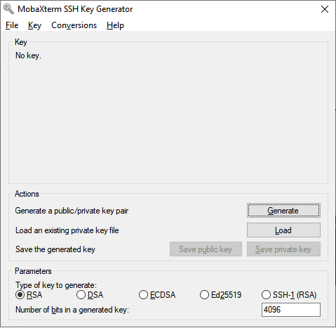
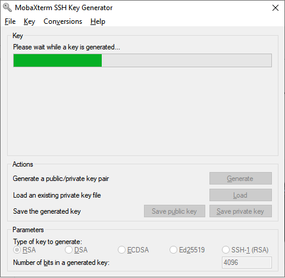
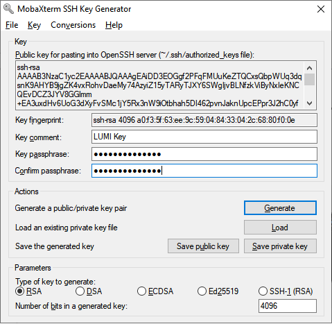

[jump-register-keys]: #register-your-public-key

# Setting up SSH keypair

!!! tip
    A SSH keypair for password-less access within the UBELIX HPC system is
    automatically generated for all accounts since 12.11.2024. Note that this
    keypair is automatically rotated and should therefore not be
    used for any other purpose.

If you want to use UBELIX from a terminal, we recommend to register a SSH keypair. SSH keypairs serve as a means of identifying a user to a SSH server. When using SSH keys your password will never be send over the network.

UBELIX only accepts SSH keys based on the RSA (4096 bit) or ed25519 algorithms.
If possible, we recommend using ed25519.

## Generate your SSH keys

If you already have an appropriate SSH key pair that you want to use with UBELIX,
you may skip to [registering your public key][jump-register-keys]. If not,
start by generating an SSH key pair as detailed below.

=== "From a terminal (all OS)"

    An SSH key pair can be generated using a Linux, macOS, Windows PowerShell
    terminal. For example, you can use the following command to generate
    an ed25519 key:

    ```bash
    ssh-keygen -t ed25519 -f $HOME/.ssh/id_ed25519_ubelix
    ```

    You will be asked for a passphrase. Please choose a secure
    passphrase. It should be at least 8 (preferably 12) characters long and
    should contain numbers, letters and special characters. **Do not leave the
    passphrase empty**.

    After that an SSH key pair is created, i.e. a pair of files containing
    the public and private keys, e.g. files named `id_ed25519_ubelix`
    (the **private** key) and `id_ed25519_ubelix.pub` (the **public** key) in your
    `/home/<username>/.ssh/` directory.

=== "With MobaXTerm (Windows)"

    An SSH key pair can be generated with MobaXterm
    (**Tools :octicons-arrow-right-16: MobaKeyGen**).
    
    In order to generate your key pairs for UBELIX, choose the option Ed25519. 
    Then, press the *Generate* button.

    <figure>
      
    </figure>

    You will be requested to move the mouse in the Key area to generate some 
    entropy; do so until the green bar is completely filled.

    <figure>
      
    </figure>

    After that, enter a comment in the Key comment field and a strong
    passphrase. Please choose a secure passphrase. It should be at least 8
    (preferably 12) characters long and should contain numbers, letters and
    special characters. **Do not leave the passphrase empty**.

    <figure>
      
    </figure>

    The next step is to save your public and private key. Click on the *Save 
    public key* button and save it to the desired location (for example, with 
    `id_ed25519_ubelix.pub` as a name). Do the same with your private key by clicking
    on the *Save private key* button and save it to the desired location (for 
    example, with `id_ed25519_ubelix` as a name).

    !!! note "Key format"

        To use your key, you may need two different key formats. The
        instructions above generate a private key in PuTTY format (PPK), which
        can be used with PuTTY and in a MobaXTerm SSH session created via the
        MobaXTerm GUI.
                
        However, if you are using the OpenSSH client (the ssh command in a
        MobaXTerm terminal), you will need a key in the OpenSSH format. To
        convert your key, go to the **Conversions :octicons-arrow-right-16:
        Export OpenSSH key** menu in the key generator tool and save it in the
        OpenSSH format.

        You can convert between these two key formats at any time using the key
        generator tool. Load a key by using the **Conversions :octicons-arrow-right-16:
        Import key** menu, then save it in the desired format: 
        
          - OpenSSH to PPK: load a OpenSSH key, then save it with the **Save
            private key** button
          - PPK to OpenSSH: load a PPK key, then save it via the **Conversions
            :octicons-arrow-right-16: Export OpenSSH key** menu

!!! warning
    The private key should never be shared with anyone, not even
    with UBELIX staff. It should also be stored only on your local computer
    (public keys can be safely stored in cloud services). Protect it with a good
    password! Otherwise, anyone with access to the file system can steal your
    SSH key.

## Register your public key

To register your ssh key with your UBELIX account the generated public key need to be added to the `~/.ssh/authorized_keys` file in your UBELIX account. This step can be done by simply issuing from your terminal:

```bash
ssh-copy-id -i ~/.ssh/id_ed25519_ubelix.pub `<alias>`
```

If the previous steps were successful you can now login to UBELIX using your SSH
keypair using 

```bash
ssh -i ~/.ssh/id_ed25519_ubelix <user>@submit01.unibe.ch
```
Note that you will be prompted for the passphrase of your SSH-key instead of your
Campus Account password.

## Tweaking your SSH config

To simplify the login procedure you can tweak the local SSH configuration by adding a host declaration to `~/.ssh/config` on your local desktop/laptop. This way we can omit typing the username and ssh-key from our `ssh` invocation. Note that you will need to substitute your own Campus Account username:

```bash
~/.ssh/config

Host ubelix
    Hostname submit02.unibe.ch
    User <user>
    IdentityFile ~/.ssh/id_ed25519_ubelix
    ServerAliveInterval 60
```

From now on you can log in to the cluster by using the specified alias:

```
ssh ubelix
```

!!! info "SSH session timeout"

    In the definition above we silently introduced the `ServerAliveInterval 60` option. If a SSH connection goes idle for a specific amount of time (default 10 minutes), you may be confronted with a `"Write failed: Broken pipe"` error message or the connection is simply frozen, and you are forced to log in again. To prevent this from happening, we configure the client to periodically send a message to trigger a response from the remote server through the `ServerAliveInterval` option

### SSH Agent

By this point you have replaced typing your campus account password by typing your ssk-key passphrase every time you login to UBELIX. But you can use the helper tool `ssh-agent` to securely save your passphrase, so you do not have to re-enter it all the time.

The behavior of `ssh-agent` depends on the flavor and version of your operating system. On MacOS your keys can be saved in the system’s keychain. Most Linux installations will automatically start `ssh-agent` when you log in.

Add the key to ssh-agent:

```bash
ssh-add ~/.ssh/id_ed25519_ubelix
```

You will now have to provide your ssh key's passphrase once per reboot of your device.

