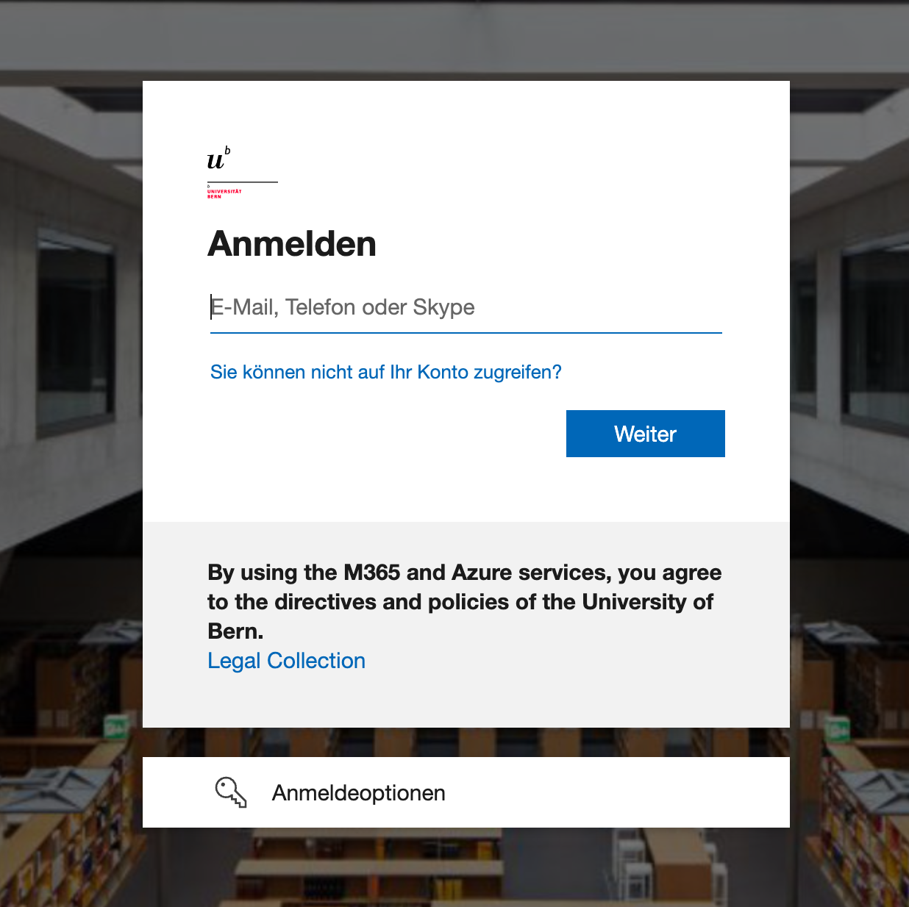
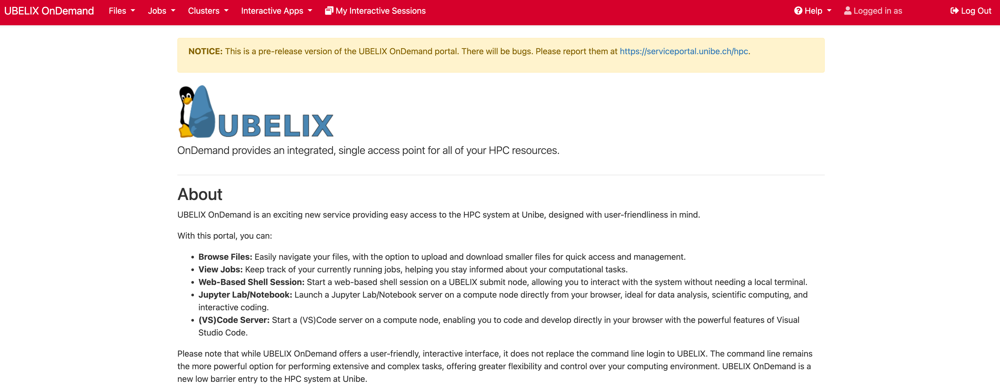

# Logging in (with web interface)

We provide interactive HPC access including various interactive apps through the browser-based UBELIX OnDemand service available at [https://ondemand.hpc.unibe.ch](https://ondemand.hpc.unibe.ch).

!!! tip
    UBELIX OnDemand requires an active UBELIX HPC account. Please request an account following the [instructions in the documentation](https://hpc-unibe-ch.github.io/getting-Started/account.html) **before** you try to use the OnDemand portal!

1. Visit [https://ondemand.hpc.unibe.ch](https://ondemand.hpc.unibe.ch) in your
   web browser.
2. You will be greeted by the Unibe Microsoft login screen. Use your **@unibe.ch** or **@students.unibe.ch** email address and the
   correspoding password to log in.
   
3. Once the login is complete you will see the UBELIX OnDemand dashboard:
   

