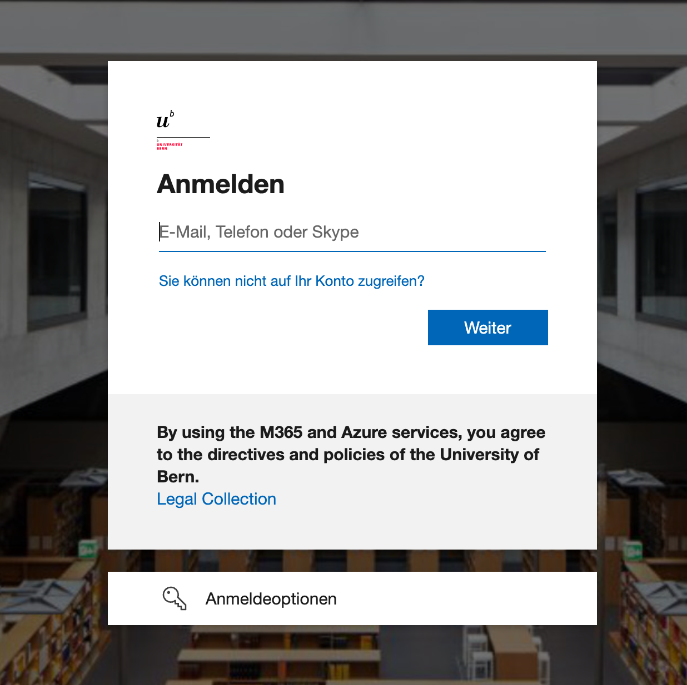
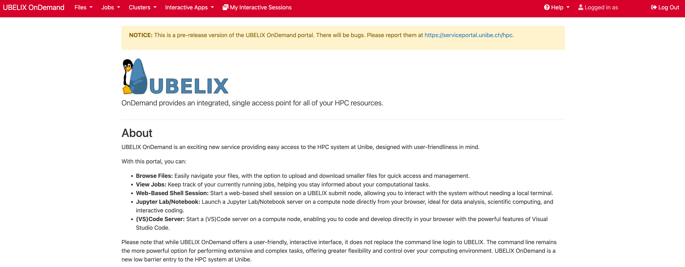

# Logging in (with web interface)
!!! caution Requirement
    Logging in to UBELIX is only possible from within the UniBE network. If you want to connect from outside, you must first establish a VPN connection. For VPN profiles and instructions see [the official tutorial](http://www.unibe.ch/university/campus_and_infrastructure/rund_um_computer/internetzugang/access_to_internal_resources_via_vpn/index_eng.html).

We provide interactive HPC access including various interactive apps through the browser-based UBELIX OnDemand service available at [https://ondemand.hpc.unibe.ch](https://ondemand.hpc.unibe.ch).

## First-time login:
!!! info
    To access UBELIX, you must be a researcher or student at the University of
    Bern with a staff, student, or faculty Campus Account. Note that when using UBELIX, you accept and adhere to the [terms of service](../terms-of-service.md)

1. Visit [https://ondemand.hpc.unibe.ch](https://ondemand.hpc.unibe.ch) in your web browser.
2. You will be greeted by the Unibe Microsoft login screen. Use your **@unibe.ch** or **@students.unibe.ch** email address and the corresponding password to log in.
   
3. Once the login is complete, you will see the UBELIX OnDemand dashboard, and your account will be created successfully.
   
4. Want to log in using SSH? Check out our [UBELIX SSH guide](./loggingin-ssh.md)
