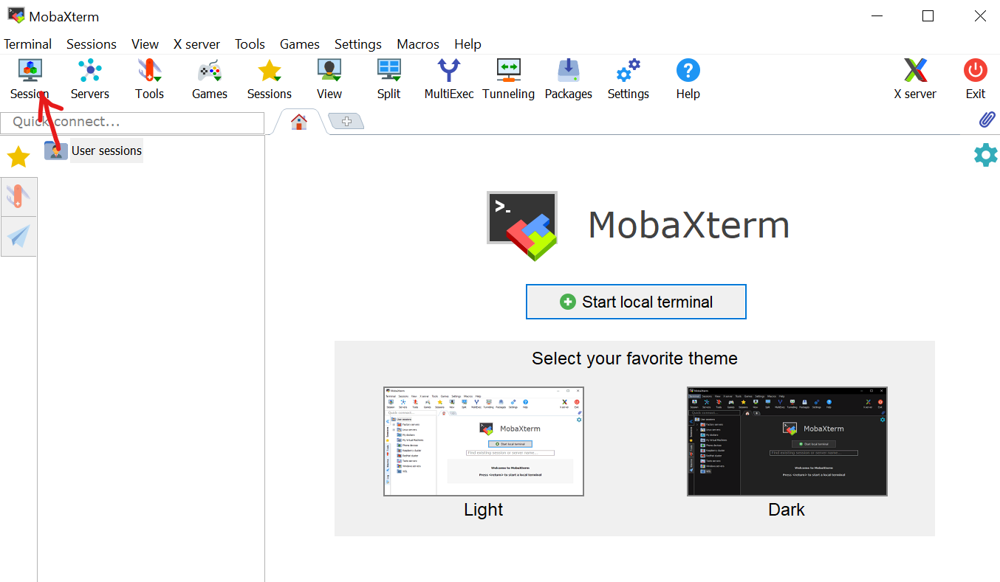
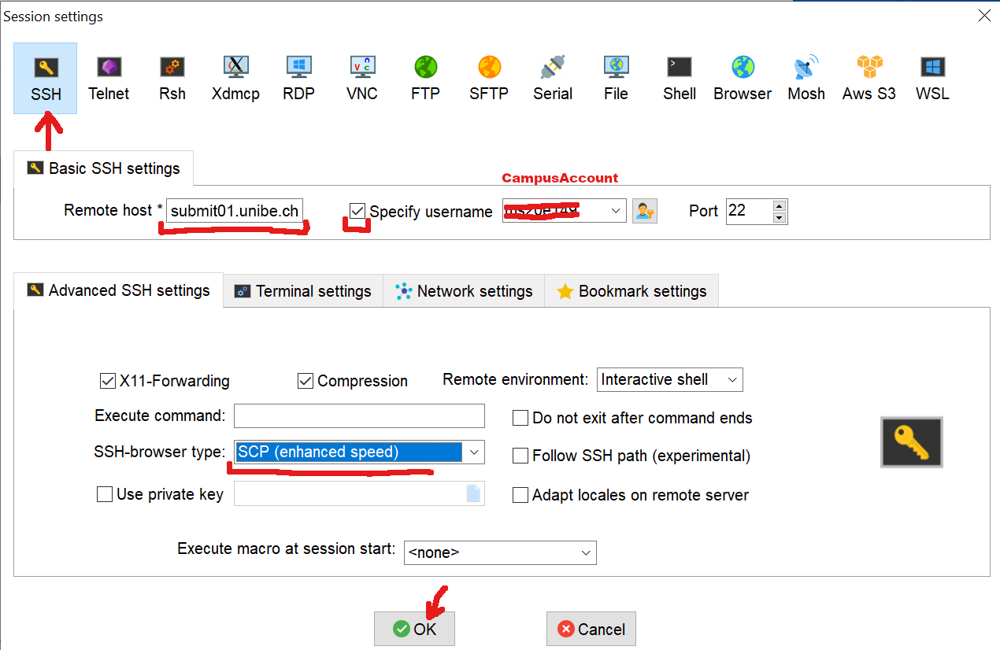
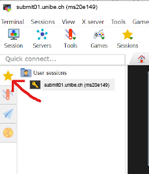
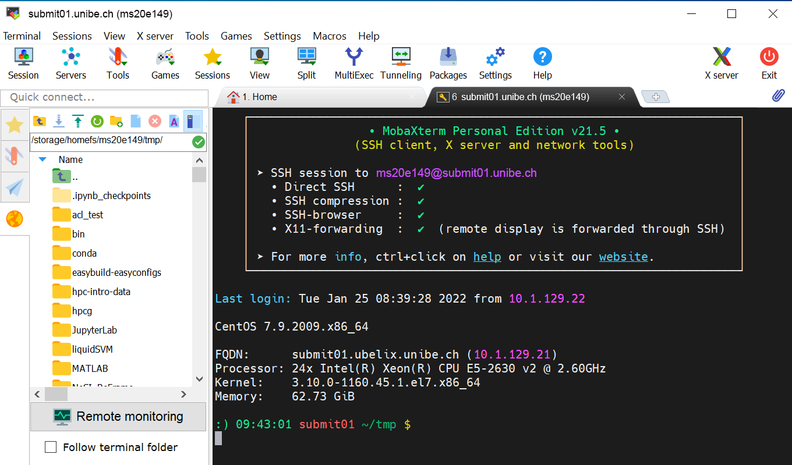
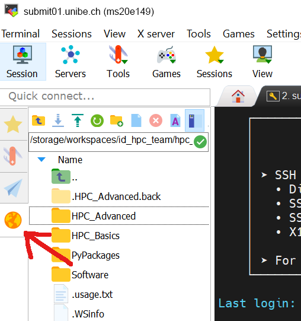

[access]: ../firststeps/accessUBELIX.md
[helpdesk]: ../support/index.md
[setup-ssh-key]: ../firststeps/SSH-keys.md


# Logging in (with an SSH client)

!!! caution "Requirement"
    Login to UBELIX is only possible from within the UniBE network. If you want to connect from outside, you must first establish a VPN connection. For VPN profiles and instructions see [the official tutorial](http://www.unibe.ch/university/campus_and_infrastructure/rund_um_computer/internetzugang/access_to_internal_resources_via_vpn/index_eng.html).


=== "From a terminal (all OS)"

    Connecting to UBELIX via the command line is possible from all major OS. Once you
    have [activated your account for UBELIX][access] you can connect using an ssh client:
    
    ```Bash
    $ ssh <user>@submit02.unibe.ch
    ```
    
    where you need to replace `<username>` with your own Campus Account username.
    
    When you connect for the first time, you
    will also be asked to check the host key fingerprint of the system and need to
    type `yes` in order to accept it. The fingerprints of the UBELIX login nodes are
    listed in the table below. Please make sure that the host key fingerprint
    matches one of these.
    
    At the password prompt enter your Campus Account password:
    
    ```Bash
    $ ssh <user>@submit03.unibe.ch
    Password:
    ```
    
    !!! types tip ""
        Usually there is no indication of typing when entering your password (not even asterisks or bullets). That's intended. Just enter your password and press 'enter'.
    
    After log in successfully you will see the welcome message and the command prompt:
    
    ```Bash
    Rocky 9.3 Blue Onyx
    
    FQDN:      submit03.ubelix.unibe.ch
    Processor: 128x AMD EPYC 7742 64-Core Processor
    Kernel:    5.14.0-362.13.1.el9_3.x86_64
    Memory:    128.223 GB
    
    [user@submit03 ~]$
    ```

=== "With MobaXTerm (Windows)"

    MobaXterm combines Terminal sessions with file transfer (scp/ftp) and X Window Server. There are many more features which are not described here. MobaXterm can be downloaded on the [MobaXterm Website](https://mobaxterm.mobatek.net/). There are two versions, portable and installation. You can choose either one.
    
    After installing and starting MobaXterm, a SSH session need to be configured:
    
     * Click 'Session' in the top left corner:
     
     * In "SSH" tab:
         - Set the remote host to a login node, e.g. submit01.unibe.ch
         -  Enable the "Specify username" option and put your Campus Account short name in the corresponding box (here user ms20e149 will be used)
     * In the "Advanced SSH settings"
         - Set SSH-browser type to 'SCP (enhanced speed)'
         -  Optionally, tick the 'Follow SSH path' button
    
    
    * From now one the settings are stored and you can access the session on the left at the star icon
    
    
    * MobaXterm will ask you to store the Password and manage a MasterPassword. 
    
    After starting the session, you should see the UBELIX login message and prompt. 
    
    On the left hand side a File browser is located. There the UBELIX file system can be browsed and files up or downloaded, e.g. using drag and drop or the context menue. 
    

!!! tip "Login nodes"

       There are four login nodes in UBELIX:

       - submit01.unibe.ch
       - submit02.unibe.ch
       - submit03.unibe.ch
       - submit04.unibe.ch

       To access UBELIX, **you can choose any one**. If the load on a login node is high, you can log out and pick another one.


## Host key fingerprints

| Host | Fingerprint                                              |
|--------- --|----------------------------------------------------------|
| submit01.unibe.ch | SHA256:ScUNCxSnHzfxeLIVB8WY98EvKoVhBujbz6RXaSOw1VA (RSA)<br> SHA256:qmMfIbwyosfLUsY8BMCTgj6HjQ3Im6bAdhCWK9nSiDs (ED25519) |
| submit02.unibe.ch | SHA256:eRTZGWp2bvlEbl8O1pigcONsFZAVKT+hp+5lSQ8lq/A (ED25519)<br> SHA256:Q4M+Tv3XsAuFLPdv2t/x3X3QY3IDsKMbNBwFcLoQeS8 (RSA) |
| submit03.unibe.ch | SHA256:IYp6P61TybgGdbBd4w9+bQpIk8Yc3XfYLHG0CslCs6Y (RSA)<br> SHA256:PUkldwWf86h26PSFHCkEGKsrYlXv668LeSnbHBrMoCQ (ED25519) |
| submit04.unibe.ch | SHA256:+maM19oNjmc6wyHyQSq1eqNtFKPPrEs+fdQm5maZyN8 (RSA)<br> SHA256:D3cmfXkb40P7W935J2Un8sBUd4Sv2MNLkvz9isJOnu0 (ED25519) |


## Troubleshooting

If you have trouble connecting to UBELIX, you can run the SSH client with verbose
output enabled to get more information about what happens when you try to connect:

```bash
ssh -vvv <username>@submit02.unibe.ch
```

If you are unable to connect, and you contact the [UBELIX support ][helpdesk],
we recommend that you provide the output of this command as part of your
support request. Please include the output as text (copy from terminal, paste
into support request), not as pictures.
