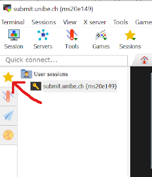
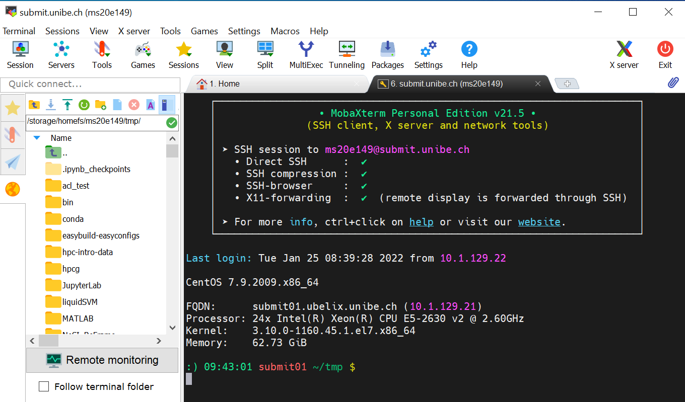

# Login

## Description

UBELIX is available to everybody with a valid Campus Account (CA) of the University of Bern. The cluster is meant to be used for research related to the University of Bern. 
**Before you can use this service we have to activate your CA for UBELIX**, see [Accounts and Activation](account.md). 
This page contains information on how to configure your SSH environment for a simplified login procedure and information regarding the application of a CA for external researchers.

## Log in to UBELIX

!!! types note "Before proceeding make sure that:"
    * you have your Campus Account activated for UBELIX (see above)
    * you have a working SSH client
        * Linux/Mac: e.g ssh command in a terminal 
        * Microsoft Windows: **MobaXterm** or Windows Subsytem Linux. Alternatively, a flavor of Linux can be installed on Microsoft Windows using virtualization software (e.g VirtualBox). We strongly encourage you to familiarize with a Unix-based Terminal commands. 
    

!!! types caution "Requirement"
    Login to UBELIX is only possible from within the UniBE network. If you want to connect from outside, you must first establish a VPN connection. For VPN profiles and instructions see [the official tutorial](http://www.unibe.ch/university/campus_and_infrastructure/rund_um_computer/internetzugang/access_to_internal_resources_via_vpn/index_eng.html).

!!! types note "Login nodes"
    There are four login nodes in UBELIX:

    - submit01.unibe.ch
    - submit02.unibe.ch
    - submit03.unibe.ch
    - submit04.unibe.ch

    To access UBELIX, **you can choose any one**. If the load on a login node is high, you can log out and pick another one. When using a terminal multiplexer like tmux or screen, you can directly log in to the login node where your tmux/screen session is running.

### Mac/Linux/Unix

Run the following commands in a terminal. Open an SSH connection to :

```Bash
$ ssh <user>@submit03.unibe.ch
OR
$ ssh -l <user> submit03.unibe.ch
```
At the password prompt enter your Campus Account password:

```Bash
$ ssh <user>@submit03.unibe.ch
Password:
```

!!! types note ""
    Usually there is no indication of typing when entering your password (not even asterisks or bullets). That's intended. Just enter your password and press 'enter'.

After log in successfully you will see the welcome message and the command prompt:

```Bash
Last login: Mon Aug 15 10:22:09 2022 from 130.92.8.162

CentOS 7.9.2009.x86_64

FQDN:      submit03.ubelix.unibe.ch (10.1.129.23)
Processor: 128x AMD EPYC 7742 64-Core Processor
Kernel:    3.10.0-1160.62.1.el7.x86_64
Memory:    125.67 GiB

[user@submit03 ~]$
```

!!! type note "Customize your SSH session"
    Useful feartures like SSH alias, X and port forwarding are described on our page [SSH customization](ssh-customization.md). 

### MobaXterm at Microsoft Windows

Here we present the configuration and first steps using MobaXterm. This tool combines Terminal sessions with file transfer (scp/ftp) and X Window Server. There are many more features which are not described here. For a productive work environment you should get familiar with the tools, configuration and features. 

MobaXterm can be downloaded on the [MobaXterm Website](https://mobaxterm.mobatek.net/). There are two versions, portable and installation, you can choose one.

After installing and starting MobaXterm, a SSH session need to be configured:

 * Click 'Session' in the top left corner:
 
 * In "SSH" tab:
     - Set the remote host to a login node, e.g. submit01.unibe.ch
     -  Enable the "Specify username" option and put your Campus Account short name in the corresponding box (here user ms20e149 will be used)
 * In the "Advanced SSH settings"
     - Set SSH-browser type to 'SCP (enhanced speed)'
     -  Optionally, tick the 'Follow SSH path' button


* From now one the settings are stored and you can access the session on the left at the star icon


* MobaXterm will ask you to store the Password and manage a MasterPassword. 

After starting the session, you should see the UBELIX login message and prompt. 

On the left hand side a File browser is located. There the UBELIX file system can be browsed and files up or downloaded, e.g. using drag and drop or the context menue. 


