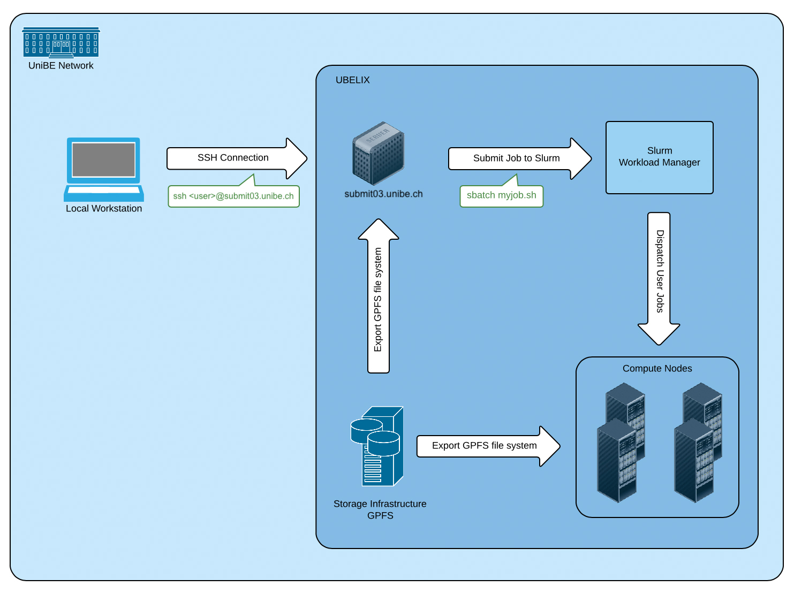

# UBELIX - Overview

## Description

This page provides a high-level system overview of a HPC cluster such as UBELIX. It describes the different hardware components that constitute the cluster and gives a quantitative list of the different generations of compute nodes in UBELIX.

**UBELIX** (University of Bern Linux Cluster) is a HPC cluster that currently consists of about 330 compute nodes featuring almost 10'000 CPU cores and ~333'000 GPU cores and a software-defined storage infrastructure providing ~3 PB of disk storage net. UBELIX is a heterogeneous cluster, meaning UBELIX consists of different generations of compute nodes with different instruction sets. Compute nodes, front-end servers and the storage are interconnected through a high speed Infiniband network. The front-end servers also provide a link to the outside world. UBELIX is used by various institutes and research groups within chemistry, biology, physics, astronomy, computer science, geography, medical radiology and others for scientific research and by students working on their thesis.

## High-level system overview

The HPCs can only be reached within the UniBE network. User landing point are the login nodes, where jobs can be prepared and submitted. Computational tasks are scheduled and managed on the compute nodes using SLURM. All compute nodes as well as the login nodes have access to the parallel file system.

### Login node aka. Submit node

A user connects to the cluster by logging into the **submit** host via SSH. You can use this host for medium-performance tasks, e.g. to edit files or to compile smaller programs. Resource-demanding/high-performance tasks must be submitted to the batch queuing system as jobs, and will finally run on one or multiple compute nodes. Even long running compile tasks should be submitted as a job on a compute node instead of running it on the submit host. 

### Batch-Queueing System

On UBELIX we use the open-source batch-queueing system [Slurm](https://slurm.schedmd.com/documentation.html), managing all jobs on the compute nodes. The job submission is described in detail in the Job handling section, starting with [Submitting jobs](../slurm/submission.md). 

The procedure look like:

- **resource definition**: as a user, **you** define the resources requirements of your job including **numbers of CPU cores**, **time** limit, **memory**, etc. Not specified parameters are chosen with **default values**. These resources can be defined in the batch script or as command line arguments
- **submitting**: job can be submitted using `sbatch` (using a batch script), `srun` (directly running the executable), or `salloc` (interactive submission). The submission is checked from SLURM if it is within the specification and limits. 
- **scheduling**: Slurm is finding the optimal spots for the registered jobs on the resources and time. This also includes priority handling and optimizing for best coverage. 
- **launch**: Slurm prepares the environment on the selected compute resources. This also includes setting up the MPI environment, if requested interactive sessions, etc., and launching your batch script. 
- **serial/parallel tasks**: per default all the tasks defined in your batch script are run on the first core of your allocation. Compute tasks should be started with 'srun'. Parallel task are launched on all (or as defined) job related resources. 
- **cancelling/completing**: When tasks finished, wall time limit or memory limit is reached the job ant its environment gets removed from the resources. All output is written into file(s) (except of interactive sessions)

### Cluster Partitions (Queues) and their Compute Nodes

Partitions group nodes into logical sets. Nodes in a partition share the same limits. You can choose a partition depending on your jobs requirements (CPUs, memory, runtime). UBELIX provides several different partitions as shown in the following table including the corresponding hardware details of the compute nodes each partition is comprised of:

| Partition name | max runtime (wall clock time) in h | max memory per node | max cores/node | GPU | Node Group | CPU Generation | #Nodes | #Cores | RAM | Local Scratch |
| --- | --- | --- | --- | --- | --- | --- | --- | --- | --- | --- |
| all | 96h | 243GB | 20 cores | - | hnodes[23-42] jnodes knodes anodes[145-216] | sandybridge sandybridge ivybridge broadwell | 20 21 36 72 | 16 16 16 20 | 70GB 243GB 117GB 117GB | 250GB 500GB 850GB 850GB |
| amd | 96h | 1TB | 192 cores | - | bnode[001-026] | AMD EPYC 2 |
| empi | 24h | 117GB | 20 cores | - | anodes[003-144] | broadwell | 142 | 20 | 117GB | 850GB |
| long[^long] | 360h | 86GB | 24 cores | - | hnode[43-49] | ivybridge | 7 | 24 | 86GB | 500Gb |
| debug | 10m | 117GB | 20 cores | - | anodes[001-002] | broadwell | 2 | 20 | 117GB | 850 |
  gpu[^gpu] | 24h | 243GB | 24 | GTX 1080Ti Tesla P100 RTX 2080Ti | gnode[01-06] gnode[07-08] gnode[09-10] | broadwell | 6 2 2 | 24 | 243 GB | 850GB |
| gpu-debug | 10m | 243GB | 24 | GTX 1080Ti | gnode[11-12] | broadwell | 12 | 24 | 243 GB | 850GB |

[^long]: Due to the limited resources and the potentially long job runtime, access to the long partition must be requested explicitly once.
[^gpu]:  The gpu partition is closed by definition. If you need GPU resources, you have request access to this partition. Write an email to [hpc@id.unibe.ch](mailto::hpc@id.unibe.ch) to do so.

To access a specific nodes you may need to specify the partition or with `--constrain` option a specific architecture within a partition. 
 
[//]: # (TODO partition limits, e.g. how many cores per job, per user,...)

!!! note ""
    **The all partition is the default partition if you do not specify one explicitly.**

### Storage Infrastructure

A modular, software-defined storage system (IBM Spectrum Scale) provides a shared, parallel file system that is mounted on all frontend servers and compute nodes. Ubelix also provides a limited amount of storage space on the Campus Storage. The different storage locations are summarized in the table below. For more information about the storage infrastructure see here.

[//]: # (TODO verify correct paths)

| Path | Connection | Availability | Backup | default Quota |
| --- | --- | --- | --- | --- |
| `/storage/homefs/$USER` | Network | global | yes[^afterMig] | 1TB |
| `/storage/workspaces/` | Network | global | yes | 10TB per research group, plus additional purchased storage|
| `/scratch/network/` | Network | global | no | 50TB per space | 

[^afterMig]: Home Backup and snapshots will only be activated after the migration a Workspace introduction phase is finished