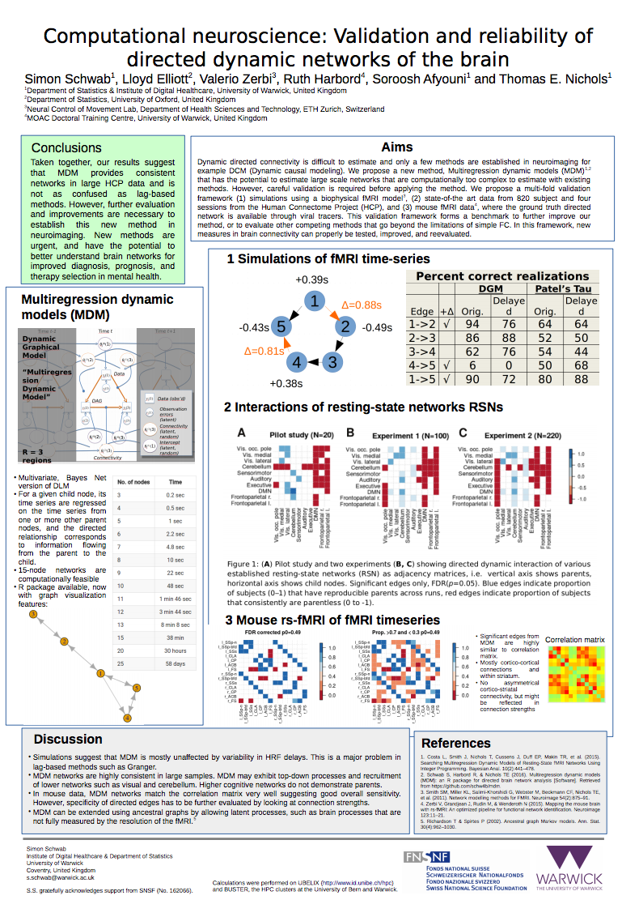

# Hall of Fame

If you previously used UBELIX to do your computational work and you acknowledged this
in your publication and want to your publication listed here, please drop us a note
at hpc@id.unibe.ch.  
If you are wondering how you can acknowledge the usage of UBELIX in your
publication, have a look at the [homepage](index.md) of this documentation, where
you will find a text recommendation acknoowledging the use of our cluster.

## Papers and Articles

Authors | Title | Journal | Boris | DOI
--- | --- | --- | --- | ---
__2020__
Riou J, Althaus C | Pattern of early human-to-human transmission of Wuhan 2019 novel coronavirus (2019-nCoV), December 2019 to January 2020 | Euro Surveillance | | [Direct Link](https://doi.org/10.2807/1560-7917.ES.2020.25.4.2000058)
__2019__
Counotte M, Althaus C et al. | Impact of age-specific immunity on the timing and burden of the next Zika virus outbreak | PLOS NeglectedTropical Diseases | [Details](http://dx.doi.org/10.7892/boris.137920) | [Direct Link](http://dx.doi.org/10.1371/journal.pntd.0007978)
Brugger J, Althaus C | Transmission of and susceptibility to seasonal influenza in Switzerland from 2003 to 2015 | Epidemics, Elsevier | [Details](http://dx.doi.org/10.7892/boris.134297) | [Direct Link](https://doi.org/10.1016/j.epidem.2019.100373)
__2018__
Horton P, Brönnimann S | Impact of global atmospheric reanalyses on statistical precipitation downscaling | Climate Dynamics | [Details](http://dx.doi.org/10.7892/boris.120012) | [Direct Link](http://doi.org/10.1007/s00382-018-4442-6)
Vonrüti N, Aschauer U | Epitaxial strain dependence of band gaps in perovskite oxynitrides compared to perovskite oxides | American Physical Society | [Details](http://dx.doi.org/10.7892/boris.120630) | [Direct Link](https://doi.org/10.1103/PhysRevMaterials.2.105401)
Aschauer U | 
Ultrafast Relaxation Dynamics of the Antiferrodistortive Phase in Ca Doped SrTiO₃
 | American Physical Society | [Details](http://dx.doi.org/10.7892/boris.119148) | [Direct Link](https://doi.org/10.1103/PhysRevLett.121.055701)
Vonrüti N, Aschauer U, et al. | Elucidation of LixNi0.8Co0.15Al0.05O2 Redox Chemistry by Operando Raman Spectroscopy | American Chemical Society | [Details](http://dx.doi.org/10.7892/boris.118507) | [Direct Link](https://doi.org/10.1021/acs.chemmater.8b01384)
Ouhbi H, Aschauer U | Water oxidation chemistry of oxynitrides and oxides: Comparing NaTaO3&nbsp;and SrTaO2N | Surface Science | [Details](http://dx.doi.org/10.7892/boris.119149) | [Direct Link](https://doi.org/10.1016/j.susc.2018.07.013)
Aschauer U | Surface and Defect Chemistry of Oxide Material | CHIMIA | [Details](http://dx.doi.org/10.7892/boris.117098) | [Direct Link](https://doi.org/10.2533/chimia.2018.286)
Kasper, C, Hebert, F, Aubin-Horth N, Taborsky B | Divergent brain gene expression profiles between alternative behavioural helper types in a cooperative breeder | Wiley Molecular Ecology |   | [Direct Link](https://doi.org/10.1111/mec.14837)

Panyasantisuk J, Dall'Ara E, Pretterklieber M, Pahr D.H., Zysset P.K.
 | Mapping anisotropy improves QCT-based finite element estimation of hip strength in pooled stance and side-fall load configurations | 
Medical Engineering &amp; Physics, Elsevier
 |   | [Direct Link](https://doi.org/10.1016/j.medengphy.2018.06.004)
Vonrüti, N, Aschauer U | Anion Order and Spontaneous Polarization in LaTiO2N Oxynitride Thin Films | American Physical Society | [Details](http://dx.doi.org/10.7892/boris.110425) | [Direct Link](https://doi.org/10.1103/PhysRevLett.120.046001)
Bouri M, Aschauer U | Bulk and surface properties of the Ruddlesden-Popper oxynitride Sr2TaO3N | Physical Chemistry Chemical Physics | <a rel="nofollow" href="https://idos-wiki.unibe.ch/10.7892/boris.110062">Details</a> | [Direct Link](https://doi.org/10.1021/acs.jpcc.7b09674)
__2017__
Aschauer, U et al. | Surface Structure of TiO2 Rutile (011) Exposed to Liquid Water | Journal of Physical Chemistry | [Details](http://dx.doi.org/10.7892/boris.108383) | [Direct Link](https://doi.org/10.1021/acs.jpcc.7b09674)
Kasper, C, Kölliker, M, Pstma, E, Taborsky B | Consistent cooperation in a cichlid fish is caused by maternal and developmental effects rather than heritable genetic variation | Proceedings of the Royal Society, Biological Sciences |   | [Direct Link](http://rspb.royalsocietypublishing.org/content/284/1858/20170369)
Riesen M, Garcia V, Low N, Althaus C | Modeling the consequences of regional heterogeneity in human papillomavirus (HPV) vaccination uptake on transmission in Switzerland | Vaccine, Elsevier | [Details](https://boris.unibe.ch/107119/) | [Direct Link](http://dx.doi.org/10.1016/j.vaccine.2017.10.103)
Kilic C, Raible C, Stocker T | Multiple climate States of Habitable Exoplanets: The Rolf of Obliquity and Irradiance | The Astrophysical Journal | [Details](https://boris.unibe.ch/106535/) | [Direct Link](https://doi.org/10.3847/1538-4357/aa7a03)
Kilic C, Raible C, Kirk | Impact of variations of gravitational acceleration on the general circulation of the planetary atmosphere | Planetary and Space Science | [Details](https://boris.unibe.ch/92580/) | [Direct Link](http://dx.doi.org/10.1016/j.pss.2016.11.001)
Mueller S, Fix M et al. | Simultaneous optimization of photons and electrons for mixed beam radiotherapy al. | Physics in Medicine &amp; Biology |   | [Direct Link](https://doi.org/10.1088/1361-6560/aa70c5)
Ninova S, Aschauer U | Surface structure and anion order of the oynitride LaTiO<small>2</small>N | Journal of Materials Chemistry A | [Details](http://dx.doi.org/10.7892/boris.101207) | [Direct Link](http://dx.doi.org/10.1039/C7TA01873H)
Ninova S, Aschauer U et al. | 
LaTiOxNy Thin Film Model Systems for Photocatalytic Water Splitting: Physicochemical Evolution of the Solid-Liquid Interface and the Role of the Crystallographic Orientation
 | Advanced functional materials | [Details](http://dx.doi.org/10.7892/boris.99013) | [Direct Link](http://dx.doi.org/10.1002/adfm.201605690)
Struchen R, Vial F, Andersson M. G. | Value of evidence from syndromic surveillance with cumulative evidence from multiple data stream with delayed reporting | Scientific Reports |   | [Direct Link](https://www.nature.com/articles/s41598-017-01259-5)

## Posters

{: style="max-width: 100%"}

## Newspapers

Title | Newspaper | Year of Publication | Link
--- | --- | --- | ---
Berner Forscher entdecken neue Klimazustände, in denen Leben möglich ist. | Der Bund | [Direct Link](https://webspecial.derbund.ch/longform/planet/planet/)
