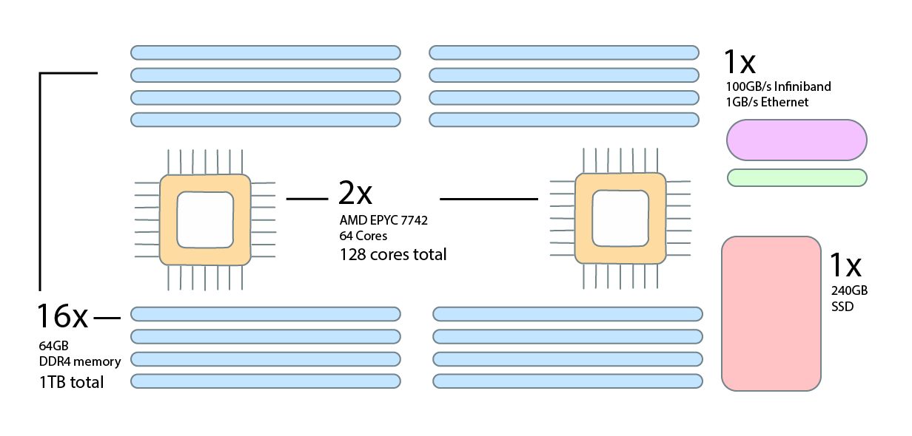

# CPU nodes

[storage]: ../storage/index.md
[interconnect]: network.md
[slurm-partitions]: ../runjobs/partitions.md

The UBELIX CPU-based hardware partition currently consists of about 250 compute nodes. Due to their different architectures, their specifications differ as shown in the table below.

| Nodes | CPUs                                               | CPU cores     | Memory   | Disk | Network     |
| :---: | :------------------------------------------------: | :-----------: | :------: | :--: | :---------: |
| 12  | 2x AMD EPYC 9654 (2.4 GHz base, 3.55 GHz boost) | 192 (2x96) | 1.5 TiB  | 1.92TiB | 100Gb/s |
| 68  | 2x AMD EPYC 7742 (2.25 GHz base, 3.4 GHz boost) | 128 (2x64) | 1 TiB  | 240GiB  | 100Gb/s |
| 170   | 2x Intel Xeon E5-2630  (2.2 GHz base, 3.1 GHz boost) | 20 (2x10) | 128 GiB  | 1TiB (HDD) | 40 Gb/s |

See the [Slurm partitions page][slurm-partitions] for an overview of options
for allocating these nodes.

## Overview

<figure>
  
  <figcaption>Overview of a UBELIX CPU compute node</figcaption>
</figure>

## CPU

Each UBELIX CPU compute node is equipped with two CPU sockets with up to 96 cores each,
depending on the node type.

## Memory

The CPU compute nodes are equipped with roughly 8GB of DDR memory per CPU core
on the AMD EPYC nodes and about 6GB per CPU core on the Intel Xeon nodes.

## Network

Depending on their generation, the UBELIX CPU compute nodes each have a single 40Gb/s or 100 Gb/s interface to the [Infiniband
interconnect][interconnect].

## Disk storage

Depending on the node type the CPU compute nodes are equipped with up to 1.5TiB
of local NVMe SSD storage avaible as local scratch for high-performance I/O operations. See the
[UBELIX data storage options][storage] for details.
