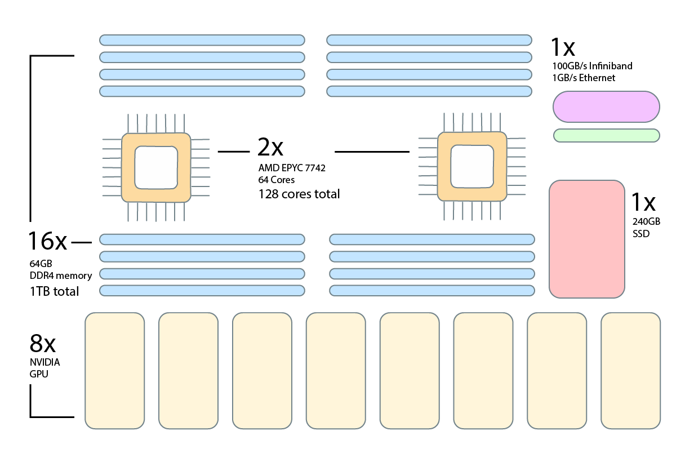

# GPU nodes

[storage]: ../storage/index.md
[interconnect]: network.md
[slurm-partitions]: ../runjobs/partitions.md

The UBELIX GPU-based hardware partition currently consists of about 30 compute nodes. Due to their different architectures, their specifications differ as shown in the table below.

| Nodes | GPUs                                               | CPU cores     | GPU Memory   | Network     |
| :---: | :------------------------------------------------: | :-----------: | :------: | :---------: |
| 7  | 8x NVIDIA GTX1080Ti | 24 (2x12) | 12 GB  | 40Gb/s |
| 7  | 8x NVIDIA RTX3090 | 32 (2x16) | 24 GB  | 40Gb/s or 100Gb/s |
| 8  | 8x NVIDIA RTX4090 | 128 (2x64) | 24 GB  | 100Gb/s |
| 2  | 8x NVIDIA P100 | 24 (2x12) | 12 GB  | 40Gb/s |
| 1  | 6x NVIDIA A100 | 128 (2x64) | 80 GB | 100Gb/s |
| 4  | 8x NVIDIA H100 | 128 (2x64) | 96 GB  | 100Gb/s |

See the [Slurm partitions page][slurm-partitions] for an overview of options
for allocating these nodes.

## Overview

<figure>
  
  <figcaption>Overview of a UBELIX H100 GPU compute node</figcaption>
</figure>

## GPU

Each GPU compute node is equipped with eight GPUs of a given type with up to 96GB GPU memory (H100) depending on the node type.

## CPU & Memory

Due to the different GPU compute node generations the amount of CPU core and memory
per node differs. In terms of available memory per GPU this can be summarized as
follows:

| GPU Type | CPUs per GPU | Memory per GPU |
| ---- | -------------| -------------- |
| Nvidia GTX 1080 Ti | 3 | 30GB |
| Nvidia RTX 3090 | 4 | 60GB |
| Nvidia RTX 4090 | 16 | 90GB |
| Nvidia P100 | 3 | 30GB |
| Nvidia A100 | 20 | 80GB |
| Nvidia H100 | 16 | 90GB |

## Network

Depending on their generation, the UBELIX CPU compute nodes each have a single 40Gb/s or 100 Gb/s interface to the [Infiniband
interconnect][interconnect].

## Disk storage

Depending on the node type the CPU compute nodes are equipped with up to 1.5TiB
of local NVMe SSD storage avaible as local scratch for high-performance I/O operations. See the
[UBELIX data storage options][storage] for details.

