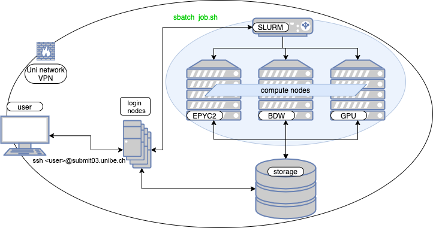

# Overview

[cpu-node]: ../hardware/cpu.md
[gpu-node]: ../hardware/gpu.md
[network]: ../hardware/network.md

[slurm]: https://slurm.schedmd.com/documentation.html 

**UBELIX** (University of Bern Linux Cluster) is a HPC cluster that currently features ~12k CPU cores and 160 GPUs.
It is a heterogeneous cluster, meaning UBELIX consists of different generations of compute nodes. Compute nodes, front-end servers and the storage are interconnected through a high speed [Infiniband network][network]. UBELIX is used by various institutes and research groups within all faculties at the University of Bern.

## High-level system overview

UBELIX can only be reached within the university network. User landing point are
the login nodes, where jobs can be prepared and submitted. Computational tasks
are scheduled and managed on the compute nodes using [SLURM][slurm], the workload
manager. All compute nodes as well as the login nodes have access to the
parallel file system.

UBELIX is a heterogeneous machine, consisting of different architectures. The majority of the CPU compute power in UBELIX is found in the [AMD (epyc)][cpu-node] hardware partition that features AMD EPYC CPUs and a smaller [Intel Broadwell (bdw)][cpu-node] partition with Intel Xeon processors. In addition to this, there is a [GPU][gpu-node] partition which features GPU accelerated nodes with a variety of GPUs.

