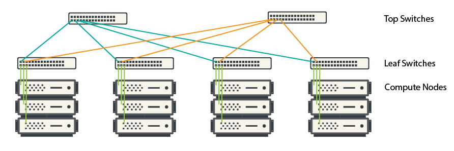

---
hide:
  - toc
---

[infiniband-wiki]: https://en.wikipedia.org/wiki/InfiniBand

All UBELIX compute nodes use the [Infiniband interconnect][infiniband-wiki]
40 Gbps or 100 Gbps network interconnect (NIC).

## Topology

UBELIX mostly uses the fat-tree network topology to enable fast and efficient
communication between the different compute nodes in the cluster. Due to the
moderate size of the UBELIX cluster we can operate a two-level topology that
consists of two layers of switches:

  1. **Leaf switches** (connected to the nodes)
  2. **Top switches** (connecting the leaf switches to each other)

Each node connects to a leaf switch, and each leaf switch is connected to every top switch. This creates **multiple paths** for data to travel between nodes. The multiple paths between individual components of the cluster prevent bottlenecks, allowing smooth data flow. Additionally this topology includes redundancy at the switch level, allowing to reroute traffic should a path fail.

The network is designed to handle many simultaneous data transfers with little to no delay, providing high performance under load.This is represented by a low blocking factor. **Blocking** refers to how much the network might limit data transfers when many nodes are communicating at once. For most nodes, UBELIX operates a **fully non-blocking** fat-tree, so that no bottlenecks due to network congestion exist.

<figure>
  
  <figcaption>Example fat tree topology.</figcaption>
</figure>
