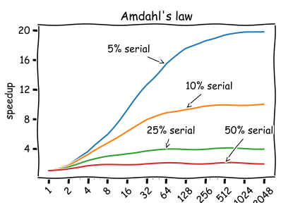
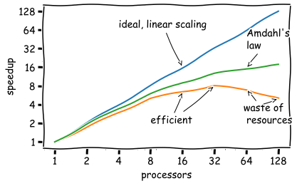

# Job Scaling

## Description

Seeking for performance improvements, applications are parallelized. The effective runtime should be decreased, by utilizing more compute resources. 
There are multiple ways of parallelization. 
**Threading** is used on shared memory architectures, implemented via OpenMP. 
**Task parallel** algorithms using MPI can run across multiple nodes. 
A so called **hybrid application** can use the advantages of both methods.

Please read first the [Parallization](../getting-Started/parallelization.md) page, where basic concepts, and usage hints are provided. 

## General Aspects

**Amdahl's law** provides a theoretical upper limit of an application speedup, considering a fixed problem size. 
Depending on the ratio between time spend in parallel versus serial regions the applications speedup scales further.  

Even if almost the whole time is spend in parallel regions, practically the scaling is limited. At a certain point a parallelization overhead will dominate the application runtime, e.g. the communication in MPI. At a certain point, increasing resource requests may lead to decreasing performance. 

## OpenMP

In general, the amount of OpenMP threads are limited by the amount of CPU cores per node. 
In practice the efficiency is limited much earlier. Reasons could be:

- problem is not big enough
- blocking operations between different threads
- increased latency when distance between memory and CPU core are increasing (different sockets, etc.)

## MPI

MPI applications can theoretically utilize the whole machine. In practice algorithms and problems often do not scale that far. Depending on the implementation, the communication increases drastically with the amount of tasks, especially for All-to-all communication patterns. 

## Empirical Tests

Especially for applications utilized many times, we may want to determine the sweet spot between performance improvement and resource usage.
Therefore, a representative test case should be selected. Ideally it would be relatively short in runtime (few iterations, *O*(5min)), using the targeted algorithm and a representative problem size.
Then the scaling would be tested separate for threading (if applicable), and MPI tasks. 
