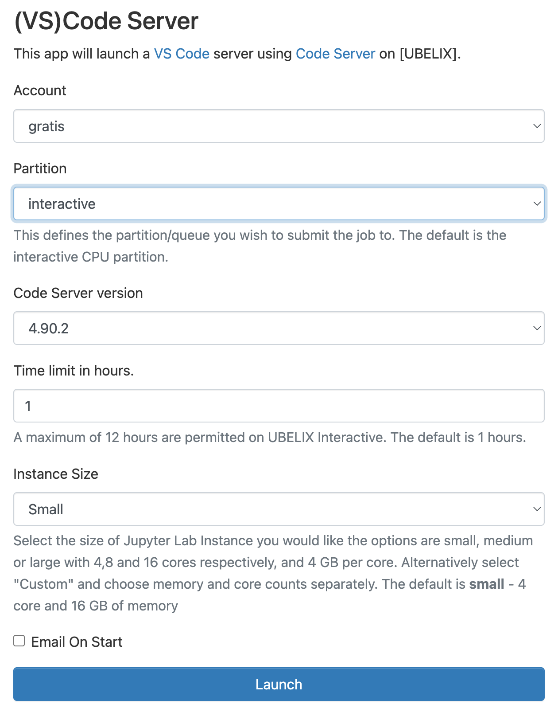

# (VS)Code server

The (VS)Code server allows you to use the (VS)Code editor on UBELIX from your
browser.

1. Select the (VS)Code Server app under Interactive Apps
   
2. Provide the job specification you want for the (VS)Code Server
   
3. Once your server is ready, click `Connect to VS Code ` to access it.
   

!!! warning
    The job may still be running if you close the window or log out. When you are done, shut down (VS)Code Server by clicking `Delete` on the session under My Interactive Sessions. You can confirm that the interactive session has stopped by checking My Interactive Sessions.

## Known limitations

*coming soon*
