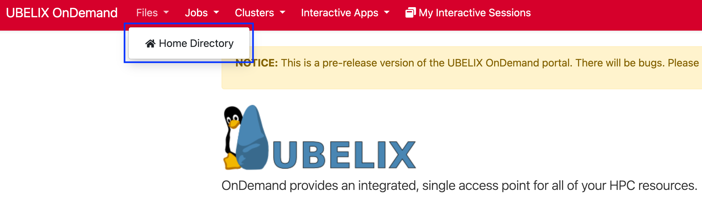

# Welcome to UBELIX OnDemand

!!! warning
    This is a pre-release version of the UBELIX OnDemand portal. There will be bugs. Please report them at [https://serviceportal.unibe.ch/hpc](https://serviceportal.unibe.ch/hpc).

UBELIX OnDemand is an exciting new service providing easy access to the HPC system at Unibe, designed with user-friendliness in mind.

With the new OnDemand portal available at [https://ondemand.hpc.unibe.ch](https://ondemand.hpc.unibe.ch), you can:

- **Browse Files:** Easily navigate your files, with the option to upload and download smaller files for quick access and management.
- **View Jobs:** Keep track of your currently running jobs, helping you stay informed about your computational tasks.
- **Web-Based Shell Sessions:** Start a web-based shell session on a UBELIX submit node, allowing you to interact with the system without needing a local terminal.
- **Jupyter Lab/Notebook:** Launch a Jupyter Lab/Notebook server on a compute node directly from your browser, ideal for data analysis, scientific computing, and interactive coding.
- **(VS)Code Server:** Start a (VS)Code server on a compute node, enabling you to code and develop directly in your browser with the powerful features of Visual Studio Code.

Please note that while UBELIX OnDemand offers a user-friendly, interactive interface, it does not replace the command line login to UBELIX. The command line remains the more powerful option for performing extensive and complex tasks, offering greater flexibility and control over your computing environment. UBELIX OnDemand is a new low barrier entry to the HPC system at Unibe.

# OnDemand Overview

We provide interactive HPC access including various interactive apps through the browser-based UBELIX OnDemand service available at [https://ondemand.hpc.unibe.ch](https://ondemand.hpc.unibe.ch).

## Loggin In

!!! tip
    UBELIX OnDemand requires an active UBELIX HPC account. Please request an account following the [instructions in the documentation](https://hpc-unibe-ch.github.io/getting-Started/account.html) **before** you try to use the OnDemand portal!

1. Visit [https://ondemand.hpc.unibe.ch](https://ondemand.hpc.unibe.ch) in your
   web browser.
2. You will be greeted by the Unibe Microsoft login screen. Use your **@unibe.ch** or **@students.unibe.ch** email address and the
   correspoding password to log in.
   
4. You will be asked to grant the OnDemand
   access to some of your profile information including your email. This is
   required to map your adress to a local user account.
5. Once the login is complete you will see the UBELIX OnDemand dashboard:
   

## Files App

Access the Files App from the top menu bar under `Files > Home Directory`. Using the Files App, you can use your web browser to:

- View files in the UBELIX filesystem.
- Create and delete files and directories.
- Upload and download (small) files from the UBELIX filesystem to your computer.

## View Active Jobs

View and cancel active Slurm jobs from `Jobs > Active Jobs`. This includes jobs started via `sbatch` and `srun`as well as jobs started (implicitly) via UBELIX OnDemand.

## Shell Access

UBELIX OnDemand allows easy browser based UBELIX shell access from the top menu bar under `Clusters > UBELIX Shell Access`.

## Interactive Apps

UBELIX OnDemand provides interactive apps. You can launch interactive apps from the `Interactive Apps` menu on the top menu bar. The available interactive apps include:

 - [ Jupyter Server (for working with Jupyter notebooks)](jupyter.md)
 - [ RStudio Server (for working in RStudio sessions)](rstudio.md)
 - [ Code Server (VS Code) (for code editing using Visual Studio
   Code)](code-server.md)
