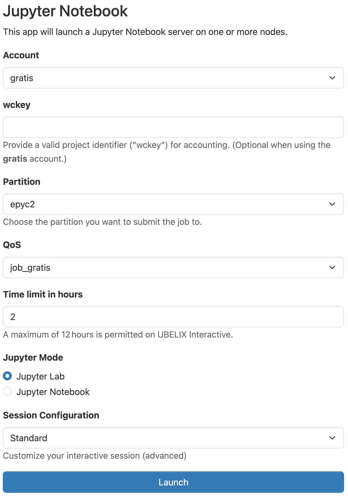
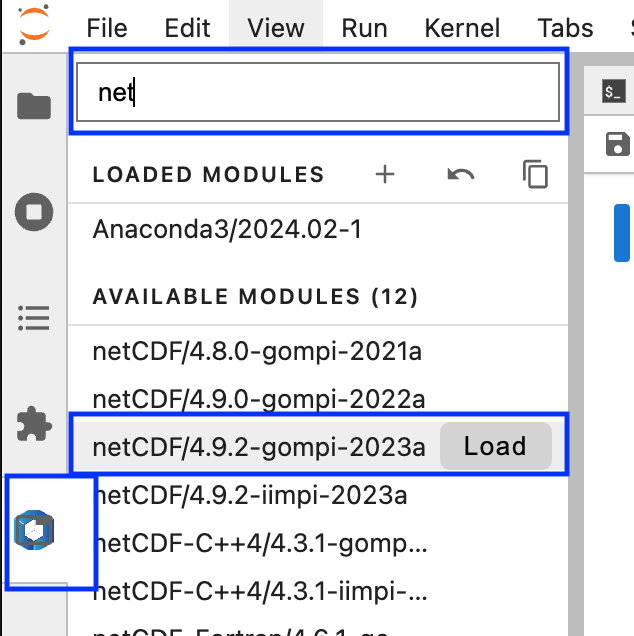

# Jupyter

The Jupyter server allows you to use the start interactive Python editors on UBELIX from your
browser.

1. Select the Jupyter Notebook app under Interactive Apps
       
2. Provide the job specification you want for the Jupyter Server
   
3. Once your server is ready, click `Connect to Jupyter` to access it.
   

!!! warning
    The job may still be running if you close the window or log out. When you are done, shut down Jupyter by clicking `Delete` on the session under My Interactive Sessions. You can confirm that the interactive session has stopped by checking My Interactive Sessions.

At this point you should already have a fully working Jupyter environment. To start working with Jupyter Notebooks, please also see the [Jupyter Documentation](http://jupyter.readthedocs.io/en/latest/).

## Loading software modules

You can load additional software modules directly from within Jupyter using the
modules extensions:

1. Choose the Module View from the left side panel
2. Search for the desired module in the search top search bar
3. Load/Unload modules as required



## Installing Python packages

A variety of standard Python packages (such as numpy, scipy, matplotlib and pandas) are available automatically. To see what packages are available, open a Terminal notebook or open a Terminal on UBELIX. Then load the Ananaconda3 module and list the installed packages:

```
module load Anaconda3/2024.02-1
eval "$(conda shell.bash hook)"
conda list
```

There should be no issues using conda or pip to install or upgrade packages and then use them in a Jupyter notebook, but you will need to make sure to install the new versions or additional packages in your home or scratch directories because you do not have write permissions to the module directories. If you'd like to install packages with `conda install` you'll need to create a conda environment in which to install packages and then create a kernel associated with your Conda environment as discussed in the next section. If you need just a few extra packages you can use `pip install --user <package>` to install the missing packages.

!!! tip
    We recommend using conda environments over pip installed packages as these
    are less prone to package conflicts during system upgrades. If you're
    experienced with Python virtualenvs you may choose these as well.

## Adding new kernels

Jupyter supports notebooks in dozens of languages, including IPython, R, Julia, etc. If you’d like to use a language not already present in the default Jupyter configuration, you’ll need to create your own kernel. You may also need to create your own kernel for a language already supported if you want to customize your environment. For example if you'd like to work in your conda environments when using your notebook.

### Adding a conda environment to Jupyter

You can add a new (Python) kernel to your Jupyter based on a conda environment. When in Jupyter, you will then be able to select the name from the kernel list, and it will be using the packages you installed. Follow these steps to do this (replacing `<env>` with the name you want to give your conda environment):

```
conda activate <env>
python -m ipykernel install --user --name <env>
```

### Removing a conda environment from Jupyter 

If you remove conda environments using `conda remove --name <env> --all` the
Jupyter kernel is left behind leading to a broken kernel. You can remove the
broken kernel using:

```
jupyter kernelspec uninstall <unwanted-kernel>
```

## Working with jupyter extensions

!!! warning
    Using additional Jupyter extensions is considered an expert feature from our
    side. Please note that we can't provide support for issues with extensions
    at this time. **(Beta testers: If you have suggestions on this workflow we're
    happy to hear them!)**

Since jupyter is installed in a location that is not writable by regular users,
the Jupyter Extension Manager is read-only. This means you can't install,
remove, enable or disable Jupyter extensions directly from the Extension Manager
within Jupyter.

If you want to use custom jupyter extensions please follow the following
procedure:

1. Load the Anaconda3 module that is used for OnDemand Jupyter:
   ```
   module load Anaconda3/2024.02-1
   ```
2. Ensure the `pip` version matches the following:
   ```
   $ which pip
   /software.9/software/Anaconda3/2024.02-1/bin/pip
   ```
3. Install a jupyterlab extension `<jupyterlab_extension>` ensuring it will be
   compatible with the OnDemand jupyter version (4.0.11):
   ```
   pip install jupyterlab==4.0.11 <jupyter_extension> --user
   ```
!!! warning
       It is important that the jupyterlab version specified matches the version on
       the server (`jupyterlab==4.0.11`) exactly. Otherwise you might end up with a
       incomtatible versions that could prevent your notebook from starting.

If you no longer need an extension please remove it from your
Jupyter using:

```
pip uninstall <jupyter_extension>
```

After stopping and restarting your server, when you return to the Jupyter page, you should see your extensions added or removed from the Extension Manager.

## Known limitations

- Extensions: It is not possible to enable/disable Jupyter extensions through
  the Extension manager. Please see the section
  [Working  with jupyter extensions](#working-with-jupyter-extensions)
