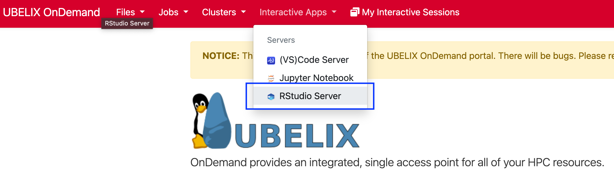
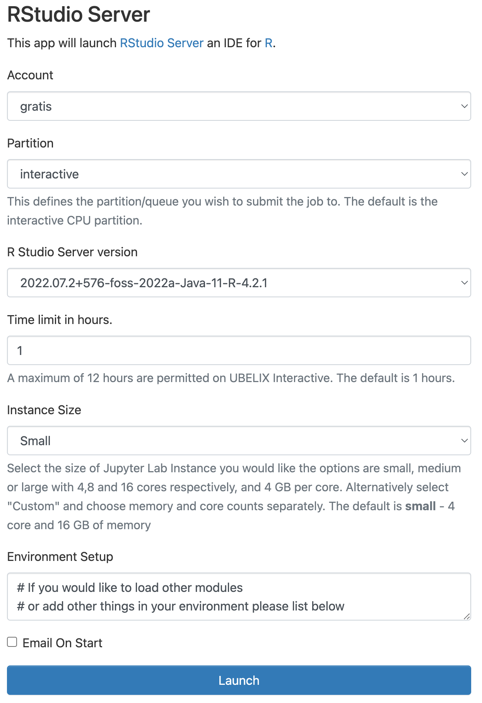

# RStudio

The RStudio server allows you to use RStudio on UBELIX.

1. Select the RStudio Server app under Interactive Apps
   
2. Provide the job specification you want for the RStudio server

    !!! tip "Choosing different accounts"
        If you are associated with a cost-enabled `paygo` project or
        have access to the `invest` account, you may choose this here as well.
        Make sure to select the appropriate combination of [partition and
        qos](../partitions.md)!
   
3. Once RStudio is ready, click `Connect to RStudio Server` to access RStudio.
   

!!! warning
    The job may still be running if you close the window or log out. When you are done, shut down RStudio by clicking `Delete` on the session under My Interactive Sessions. You can confirm that the interactive session has stopped by checking My Interactive Sessions.

## Loading software modules

If you need to load additional software modules within RStudio you can open a
Terminal window within RStudio to use the familiar `module` commands. Note that
you need to restart R from within RStudio to pickup the newly loaded modules.

Alternatively you can add additional module commands in the *Environment Setup*
section of the RStudio submission form in the OnDemand portal, i.e,

```
module load HDF/4.2.15-GCCcore-11.3.0
```

## Installing R packages

A vast amount of core R packages are pre-installed centrally - you can see what is available by using the `library()` function within R. However, given the number of packages and multiple versions available, other packages should be installed by the user.

Installing R packages from CRAN is pretty straightforward thanks to install.packages() function. For instance:

```
> install.packages(c("ggplot2", "dplyr"))
```

By default, when you install R packages, R will try to install them in the central installation. Since this central installation is shared among all users on the cluster, it's obviously impossible to install directly your packages there. This is why this location is not writable and you will get this kind of message:

```
> install.packages("ggplo2")
Warning in install.packages("ggplo2") :
  'lib = "/software.9/software/R/4.2.1-foss-2022a/lib/R/library/"' is not writable
Would you like to use a personal library instead? (yes/No/cancel)
```

This is why you have to answer **yes** to this *"Would you like to use a personal library instead?"* question.

## Known limitations

- custom R versions, e.g. from Anaconda are not supported.
  If you have an idea on how to make this happen, get in touch!
- you need to properly stop your R session from within RStudio Server before you exit or you will receive Warnings after the next login
- RStudio Server doesn't know about any SLURM environment variables. Use `system('nproc')` is a reliable way to determine how many cores are actually available to you. Please avoid using `parallel::detectCores()` in your code as it does not return the number of "allowed" cores correctly.

## Common problems

### R is taking longer to start than usual

Two of the most common session startup problems are (1) oversized global R environments, which take a long time to load into memory when the session is resumed, and (2) problematic code in `.Rprofile` which takes too long to run or throws errors during startup.

In order to help eliminate these variables as the cause of session startup issues, RStudio Server can start sessions in Safe Mode. This mode starts the session without running `.Rprofile` or restoring the global environment. If a session takes too long to start, the user will be given the option to restart a session in Safe Mode.

In some cases using safe mode shows the same issue. In this case the issue may
be linked to a previous R session and may be fixed by removing the previously
active session: `rm -r ~/.local/share/rstudio/sessions/active`.


