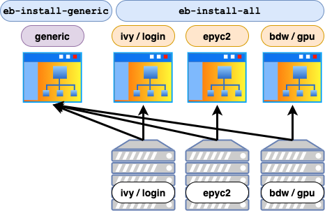

# Installing Custom Software

## Description

UBELIX comes with a plethora of software pre-installed. 
And there are tools provided installing additional packages in the user/group space. The present **CustomRepo** and **Workspace modules** provide easy access even for multiple versions of the same Software package. 
In general, the module environment is described at [HPC software environment](pre-installed-software.md). 
The command `module avail` lists the available packages and `module spider FFTW` searches for all modules which have FFTW in their name. 
This article describes a procedure for installing custom software stacks in your user/group space. An EasyBuild and a manual approach is presented.

!!! note "Note"
    You **cannot** use the packet management utility yum for this, since this command requires root privileges to install software system wide. 
    Instead you have to compile and install the software yourself. 

!!! note "Note"
    If you know that some missing software could be of general interest for a **wide community** on our machines, you can ask us to install the software system wide. Bioinformatic packages are managed by [Vital-IT](https://www.vital-it.ch/about#contact)

!!! note "Note"
    If you need further assistance in installing your software packages or optimizing for our machine architecture, get in touch with our support team. 

The **LMOD module** system allows to enable software package by package. Thus, influences between different packages can be minimized. It also allows to have multiple versions of the same software product installed side by side. 
See [HPC software environment](hpc-modules.md).

There are modules providing access to your user/group software stacks and assisting you with building packages into them. 

When possible we use [EasyBuild](https://easybuild.readthedocs.io/en/latest/) to provision software packages. 
EasyBuild is a software installation framework. Installation procedures are defined in so called EasyConfigs, including the location of the sources, dependencies, its versions, used environments, compile arguments, and more. 
These EasyConfigs are publicly available on [EasyBuild github repository](https://github.com/easybuilders/easybuild-easyconfigs) and can be downloaded used and if necessary adapted, e.g. for new versions.  

## Building Software packages
There are mainly two options to build a software package and its module:

- using **EasyBuild**, with an existing, an modified or a newly created EasyConfig
- performing **manual installation**, and creating a module file

In the following, both methods are described in more details.

In general we consider:

- Is [there](https://github.com/easybuilders/easybuild-easyconfigs) already and EasyBuild recipe available, which can be used or modified?
- Which software stack we want to build into, a specific CPU architecture, OR all CPU architectures, OR should it be a generic one (see [Software stacks](#software-stacks))

### Software stacks


On UBELIX a software stack for each **CPU architecture** is provided. Applications are build on and for this specific architecture. 
Therewith, application can use different optimizations on different architectures, e.g. using AVX2 instruction set on Broadwell).
Furthermore, a **generic** software stack is provided, where architecture independent applications are installed, e.g. Python scripts. 
Our generic software stack is build on Ivybridge nodes, which have the lowest instruction set. Therewith runtime conflicts are prevented. 

For EasyBuild additional tools are provided, which install automatically in all architectural or the generic software stack, see below.

Additionally, with the `Workspace` and `Workspace/home` module such software stacks can be created in your user/group space.


## EasyBuild
For detailed instructions read the [EasyBuild article](EasyBuild.md).

If you are installing your own application you may want to consider to create an EasyConfig for it. Have a look in the [EasyBuild documentation](https://easybuild.readthedocs.io/en/latest/), examples on the [EasyBuild github](https://github.com/easybuilders/easybuild-easyconfigs/tree/develop/easybuild/easyconfigs). And if necessary ask our support team for assistance. 

## Python and R
For many python and R packages EasyConfig exist. These can be used to install the package like all other EasyBuild packages. See [EasyBuild article](EasyBuild.md). 
Alternatively, you can use the Python/R package manager and advice them to install into your HOME/Workspace directory. Please see the [Python](python.md) or [R](r.md) pages.

## Manually compiling
There are very different ways of manually installing software packages, starting from just using a compiler, having a makefile, up to complex build systems. 
A few considerations need to kept in mind while building for our systems:

- Compilers: different compilers are available and can be loaded by modules. Toolchains bundle compiler with additionally libraries and tools, like MPI, FFTW, MKL, see [Toolchains](pre-installed-software.md#toolchains). Furthermore, complex algorithms are optimised differently in the compilers. It is worthwhile to try and compare multiple compilers. 
- CPU architectures: since there are different CPU architectures available, applications should be build for the targeted architecture. Often significant performance improvements can be obtained compiling for the correct instruction sets. Therefore, launch your build processes on the targeted architecture.
- Accessibility: On the one hand probably different versions, e.g. for compiler and CPU architecture should be provided. On the other hand the access to it should be as easy as possible for all users of that package. Therefore, modules provide a user-friendly. These modules can be organized e.g. in software stacks, one for each architecture. 

One and probably the most used procedure is the GNU configure / make:

```Bash
tar xzvf some-software-0.1.tar.gz
cd some-software-0.1
./configure --prefix=/path/to/target/some-software/0.1
make
make install
make clean
```

!!! note "Note"
    Consider creating an Easyconfig if you already have a well tested procedure, see [EasyBuild](EasyBuild.md). 

`configure` is usually a complex shell script that gathers information about the system and prepares the compile process.  
With the `--prefix` option you can specify a base installation directory, where `make install` will install the files into subdirectories like `bin`, `lib`, `include`, etc. 

The make utility is what does the actual compiling and linking. 
If, for example, some additional libraries are missing on the system or not found in the expected location, the command will exit immediately. 

Detailed documentation can be found on the [GNU make documentation page](http://www.gnu.org/software/make/manual/make.html)

## Software Stacks with Modules

The [Workspace module](../hpc-workspaces/environment.md) and the *CustomRepo* module provide a pre-defined setup where software stacks for the **different CPU architectures** as well as a **generic** one is accessible by default. 
After loading the module you will always see all the **generic** software stack and the software stack for the CPU architecture you are located on.

If you install your packages into this structure, your modules (for the correct architecture) can be accessed without additional effort. 

In general you find a structure like:

```
/path/to/workspace/Software
+-- ivybridge.el7
|   +-- ...
+-- broadwell.el7
|   +-- modulefiles
|       +-- all         # place modulefiles here with structure Name/version
|           +-- ProdXY
|               +-- 0.1 # a modulefile example
|   +-- easybuild       # the EasyBuild software directory, could be used OR
|   +-- software        # you could install under this directory
+-- generic.el7
|   +-- modulefiles
|       +-- all         # place modulefiles here with structure Name/version
|           +-- ProdXY
|               +-- 0.1 # a modulefile example
|   +-- easybuild       # the EasyBuild software directory, could be used OR
+-- sources
```

The example shows detailed structure for Broadwell and generic software stack. But the same structure can be found also for the other stacks.

The most important is the location of the modulefiles. These should be located in:

- `EASYBUILD_PREFIX/../modulefiles/all` for the architectural software stack AND
- `CUSTOM_GENERIC_EASYBUILD_PREFIX/../modulefiles/all` for the generic software stack

The prefix (set in the Workspace and CustomRepo module) contains architectural information, here for example for Broadwell: 
```
EASYBUILD_PREFIX=/storage/workspaces/hpc-group/project1/Software/broadwell.el7/easybuild
```


### Modulefiles
A modulefile describes location and environment setting for the targeted application, e.g. setting the `PATH`, `LD_LIBRARY_PATH` and other variables. 
The present Lmod system searches these Modulefiles in subdirectories of all directories registered in `MODULEPATH`. The above described architectural software stacks as well as the generic one are registered in the **Workspace** and **CustomRepo** module by default. 

There are, two types of modules, the default Linux modules, written in TCL (described below) and Lua modules (created by our EasyBuild). Lua modules are more powerful, but for simplicity we present TCL modules here. 

Assuming we want to provide an application `ProdXY`. We could create a TCL module file $WORKSPACE/Software/generic.el7/modulefiles/ProdXY as the following:

```
#%module

conflict ProdABC               # conflicts with another application ProdABC
module load Python/3.8.2-GCCcore-9.3.0 # load other additional modules

# provide a description
whatis "The ProdXY for doing clever things."
proc ModulesHelp { } {
 puts stderr "This module loads the ProdXY tool."
 puts stderr "\t the executable prodXY is provided."
}

# set the path to the software product (can be used later in the module)
set PKG_PREFIX /path/to/software/package/ProdXY
# add the location of binaries to PATH, such they are immediately accessible
prepend-path PATH $PKG_PREFIX/bin
# add to library path for dynamically linked applications
prepend-path LD_LIBRARY_PATH $PKG_PREFIX/lib
# add a location for Python packages
prepend-path PYTHONPATH $PKG_PREFIX/lib/python3.8/site-packages/
# for example, you can set environment variables for compiling
setenv CFLAGS "-DNDEBUG"
```

In the first lines, we can set conflicts with other modules (here named ProdABC). Then we load some dependency modules and provide some description. The additional lines depend on your requirements for the application. With `set` you can define internal variables (within this modulefile). 
The command `setenv` defines a environment variable, set in your environment after loading the module. And `prepend-path` and `append-path` extend an environment variable at the front or end.

There are common environment variables like:

- `PATH` for providing executables,
- `LD_LIBRARY_PATH` location of libraries, e.g. `prodXY.so`,
- `PYTHONPATH` providing Python modules,
- `CONDA_ENVS_PATH` for providing Conda environments,
etc.
And others which are very application specific.

If the module is in a registered location, it can be loaded by:

```
module load ProdXY
```


